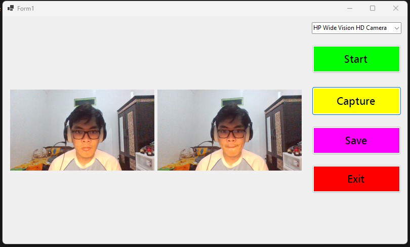

# MediaCaptureApp

<h2>Membuat Aplikasi Media Capture Sederhana Menggunakan Bahasa C#<h2>

## Nama : Sandyatama Fransisna Nugraha
## NRP: 5025211196
## Kelas : PBKK B
## Tahun : 2023

 

## Ini adalah tugas kedua setelah pembuatan aplikasi calculator dari mata kuliah Pemrogaman Berbasis Kerangka Kerja untuk mempratekkan penggunaan framework .NET dengan menggunakan bahasa C#. 
## Aplikasi ini yang dibuat adalah aplikasi sederhana yang memuat fitur dasar untuk melakukan capture gambar dengan menggunakan bantuan kamera bawaan atau eksternal dari PC/laptop. 

### 1. Memulai Program Start

### 2. Memulai Program Capture

### 3. Memulai Program Save

### 4. Hasil Dari Foto

